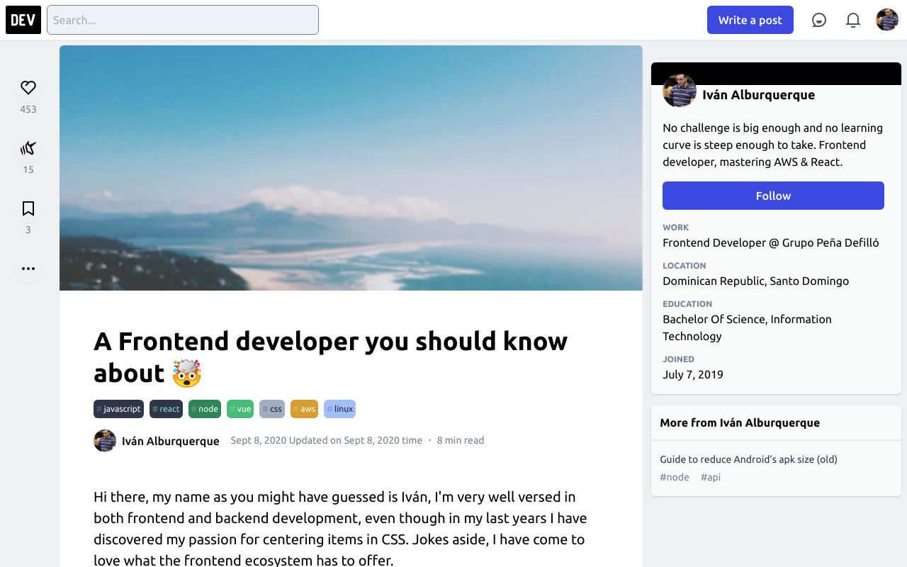

# DEV Frontend application website

A simple project with the same look and feel of the DEV website to be used as a cover letter or personalized resume to apply for the Frontend Engineer position.




To get started:

1. Clone the repository:

   ```bash
   git clone git@github.com:AlburIvan/dev-to-application.git

   cd dev-to-application
   ```

2. Install the dependencies:

   ```bash
   # Using npm
   npm install

   # Using Yarn
   yarn
   ```

3. Start the development server:

   ```bash
   # Using npm
   npm run serve

   # Using Yarn
   yarn serve
   ```

   Now you should be able to see the project running at localhost:8080.
